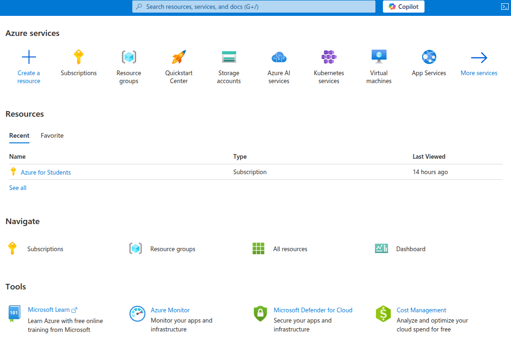
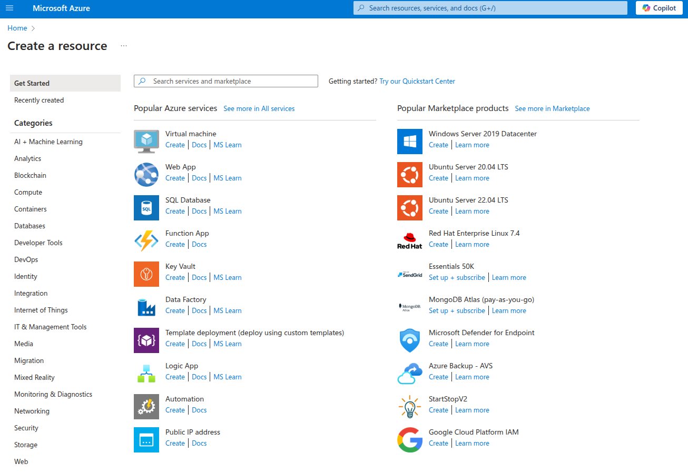
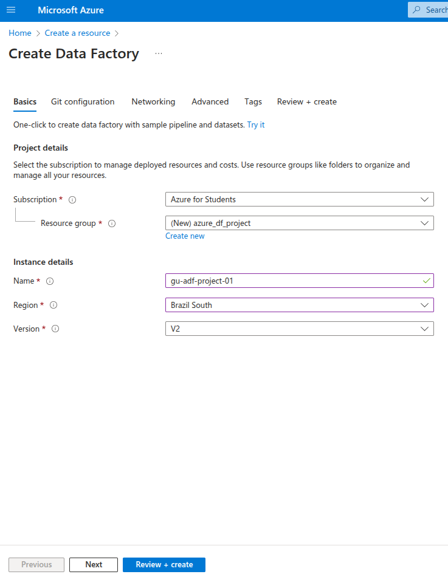
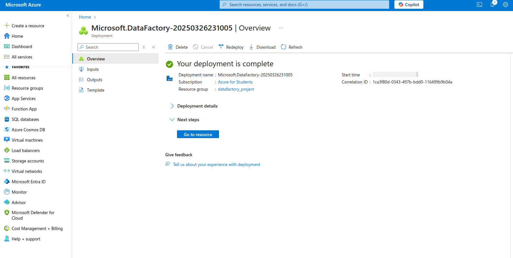
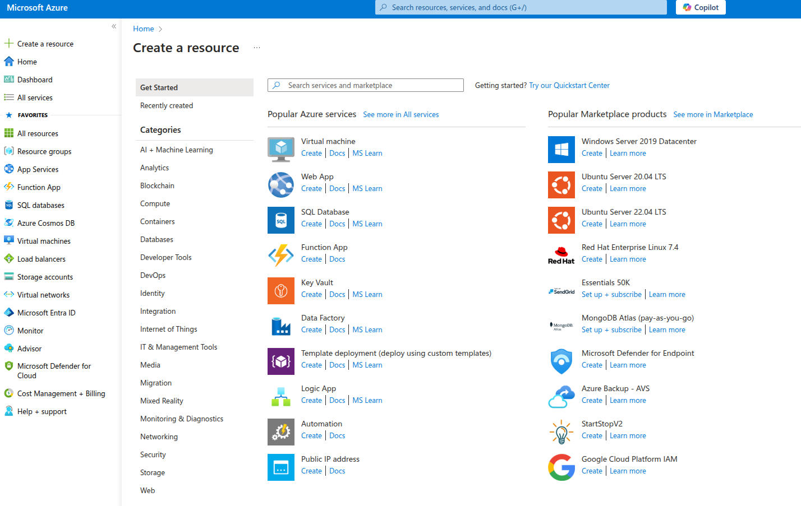
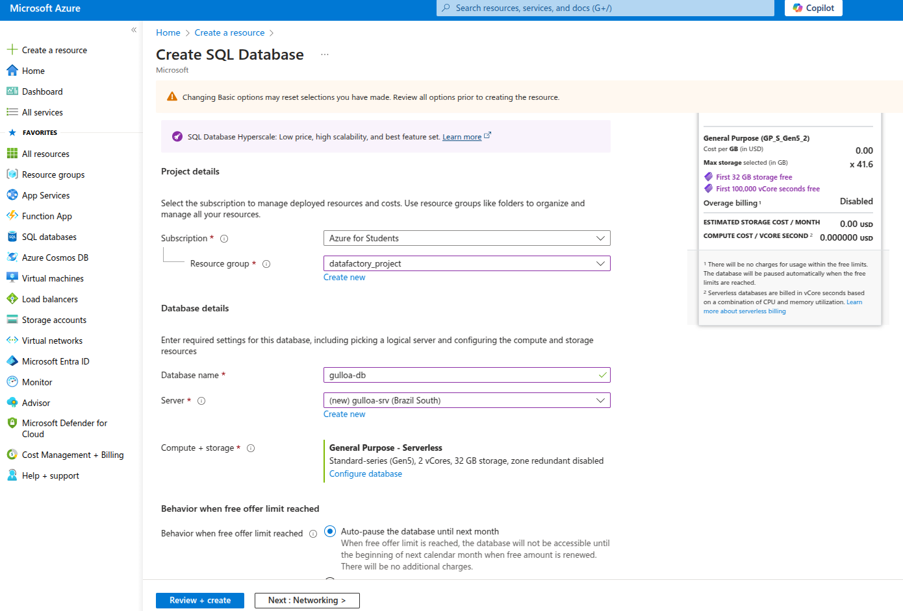
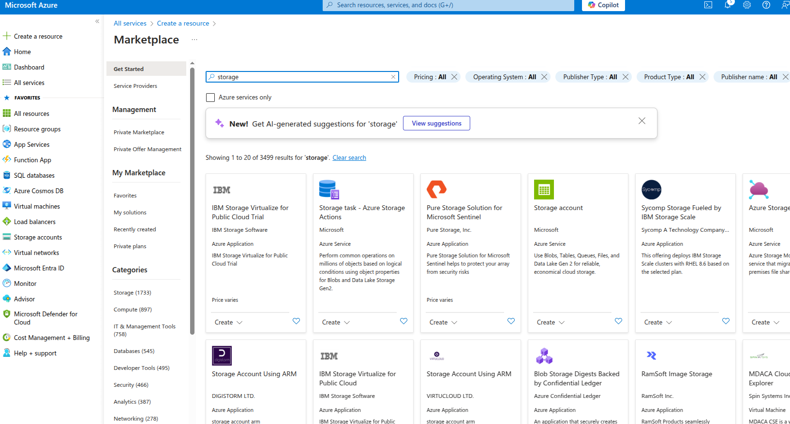
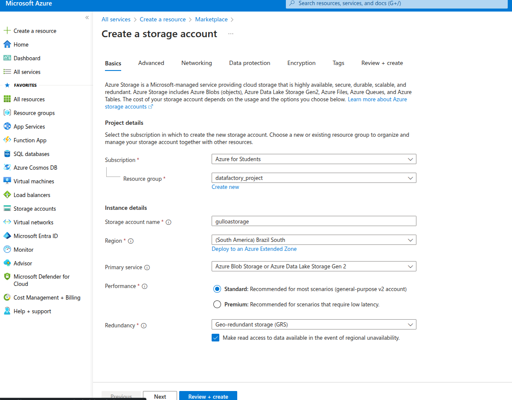
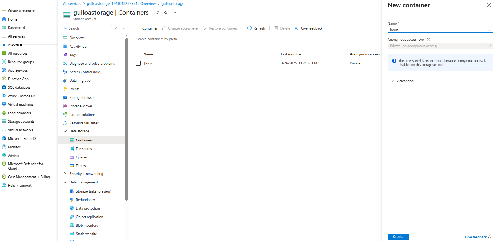

# Proyecto en Azure Portal - Azure Data Factory
La intención de este repositorio es demostrar como utilizar `Azure Data Factory`.

## Introducción a Azure Data Factory
Azure Data Factory es un servicio en la nube diseñado para proyectos híbridos de extracción-transformación-carga (ETL), extracción-carga-transformación (ELT) e integración de datos.

Data Factory contiene una serie de sistemas interconectados que proporcionan una plataforma completa de extremo a extremo para ingenieros de datos. Un resumen [aquí](https://learn.microsoft.com/en-us/azure/data-factory/media/introduction/data-factory-visual-guide.png).

Azure Data Factory permite crear flujos de trabajo (pipelines) para orquestar el movimiento de datos y transformarlos a gran escala. Puedes construir procesos ETL visualmente con flujos de datos o utilizando servicios de cómputo como Azure HDInsight Hadoop, Azure Databricks y Azure SQL Database.

Además, puedes publicar tus datos transformados en almacenes de datos como Azure Synapse Analytics para que las aplicaciones de inteligencia empresarial (BI) los consuman.

Puedes aprender más en [Microsoft Learn](https://learn.microsoft.com/en-us/azure/data-factory/introduction).

## Configuración de Azure Data Factory
### Requisitos previos:
- Una suscripción activa en Azure Portal.
### Crear una instancia Azure Data Factory
Desde la página principal selecciona `Create a resource` y selecciona `Data Factory`.

completa los siguientes campos, click en `Review + create` y en la proxima ventana `create`.

Nuestra pipeline moverá información de un archivo `.csv` a una base de datos `SQL`, necesitamos agregar estos recursos.
En la pestaña `Create a resource`, seleccionamos `SQL database`.

Completa todos los campos, luego `Review + create`.

Nos queda pendiente un recurso para almacenar el archivo origen `.csv`. Para esto agregamos un nuevo recurso `Storage account`.

Finalizada la configuración por parte de Azure, click en `Go to resource`. En la pestaña `Data Storage`, click en `Containers` y luego en `+ Container`, por ultimo click en `Create`.

Por último abrimos nuestro almacenamiento recién creado, y cargamos nuestro archivo de datos.

Ahora necesitamos configurar nuestra base de datos para esta información almacenada en un archivo `.csv`.
