# Proyecto en Azure Portal - Azure Data Factory
La intención de este repositorio es demostrar como utilizar `Azure Data Factory`.

## Introducción a Azure Data Factory
Azure Data Factory es un servicio en la nube diseñado para proyectos híbridos de extracción-transformación-carga (ETL), extracción-carga-transformación (ELT) e integración de datos.

Data Factory contiene una serie de sistemas interconectados que proporcionan una plataforma completa de extremo a extremo para ingenieros de datos. Un resumen [aquí](https://learn.microsoft.com/en-us/azure/data-factory/media/introduction/data-factory-visual-guide.png).

Azure Data Factory permite crear flujos de trabajo (pipelines) para orquestar el movimiento de datos y transformarlos a gran escala. Puedes construir procesos ETL visualmente con flujos de datos o utilizando servicios de cómputo como Azure HDInsight Hadoop, Azure Databricks y Azure SQL Database.

Además, puedes publicar tus datos transformados en almacenes de datos como Azure Synapse Analytics para que las aplicaciones de inteligencia empresarial (BI) los consuman.

Puedes aprender más en [Microsoft Learn](https://learn.microsoft.com/en-us/azure/data-factory/introduction).

## Configuración de Azure Data Factory
### Requisitos previos:
- Una suscripción activa en Azure Portal.
### Crear una instancia Azure Data Factory
Desde la página principal selecciona `Create a resource` y selecciona `Data Factory`.


completa los siguientes campos, click en `Review + create` y en la proxima ventana `create`.


Nuestra pipeline moverá información de un archivo `.csv` a una base de datos `SQL`, necesitamos agregar estos recursos.
En la pestaña `Create a resource`, seleccionamos `SQL database`.


Completa todos los campos, luego `Review + create`.


Nos queda pendiente un recurso para almacenar el archivo origen `.csv`. Para esto agregamos un nuevo recurso `Storage account`.


Finalizada la configuración por parte de Azure, click en `Go to resource`. En la pestaña `Data Storage`, click en `Containers` y luego en `+ Container`, por ultimo click en `Create`.


Por último abrimos nuestro almacenamiento recién creado, y cargamos nuestro archivo de datos.
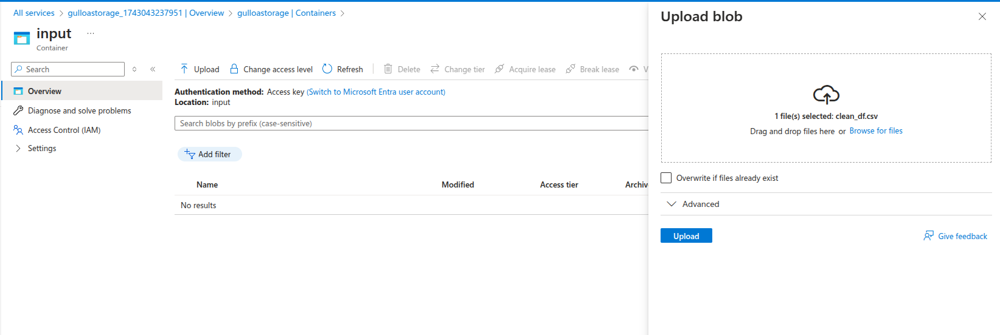

Ahora necesitamos configurar nuestra base de datos para esta información almacenada en un archivo `.csv`. Voy a la pestaña `Resource group`, selecciono el grupo donde he creado los recursos previamente, y selecciono mi base de datos `gulloa-db (gulloa-srv/gulloa-db)`. Ingreso con las credenciales configuradas en los pasos anteriores al `Query editor`. En este punto, voy a crear una tabla, que sea compatible para luego cargar los datos de mi archivo `.csv` en esta tabla.
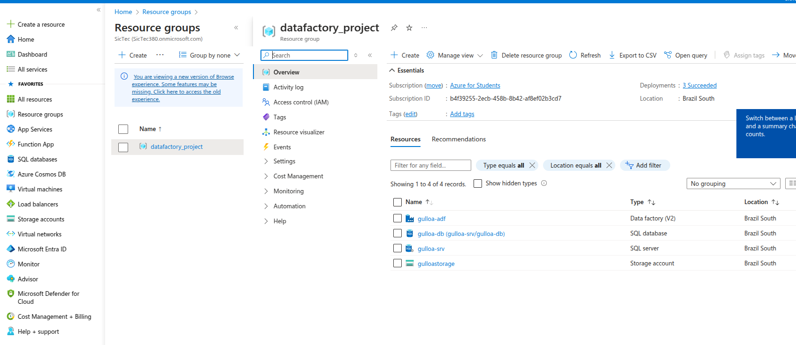

Primero debemos configurar los accesos a nuestro servidor y base de datos desde otros servicios de azure.
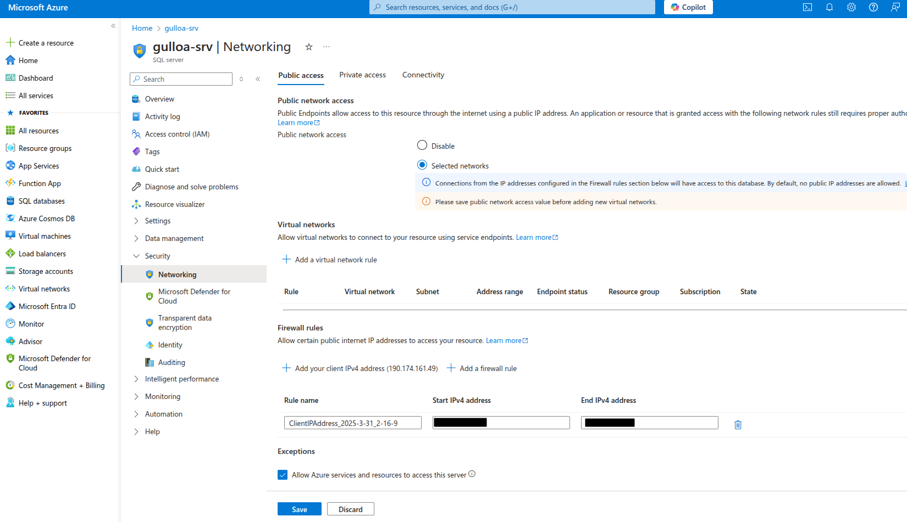

Ahora ingresamos a nuestra base de datos y al `Query Editor` con las credenciales configuradas en pasos previos.
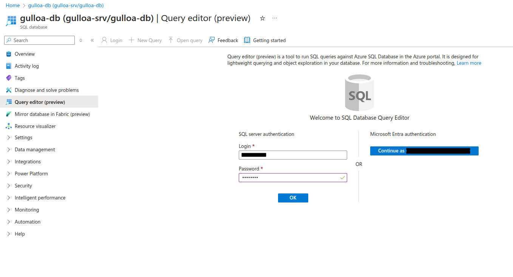

Creamos una tabla en nuestra base de datos:
```
CREATE TABLE cars_table (
    symboling INT,
    "normalized-losses" FLOAT,
    make VARCHAR(255),
    aspiration VARCHAR(255),
    "num-of-doors" VARCHAR(255),
    "body-style" VARCHAR(255),
    "drive-wheels" VARCHAR(255),
    "engine-location" VARCHAR(255),
    "wheel-base" FLOAT,
    length FLOAT,
    width FLOAT,
    height FLOAT,
    "curb-weight" INT,
    "engine-type" VARCHAR(255),
    "num-of-cylinders" VARCHAR(255),
    "engine-size" INT,
    "fuel-system" VARCHAR(255),
    bore FLOAT,
    stroke FLOAT,
    "compression-ratio" FLOAT,
    horsepower FLOAT,
    "peak-rpm" FLOAT,
    "city-L/100km" FLOAT,
    "highway-mpg" INT,
    price FLOAT,
    "price-binned" VARCHAR(255),
    "horsepower-binned" VARCHAR(255),
    diesel INT,
    gas INT
);
```
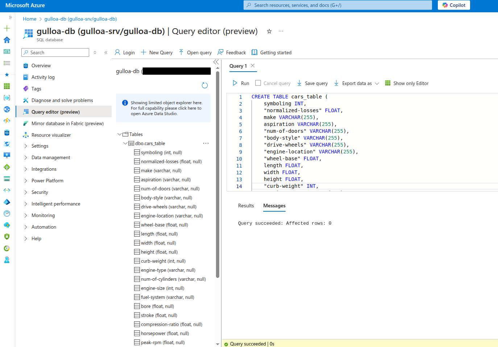

## Azure Data Factory Studio
En la pantalla principal vamos a `Author`.
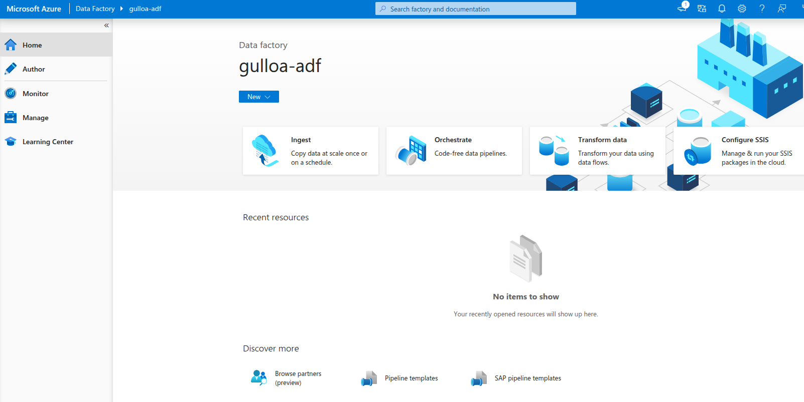

### Creamos la pipeline

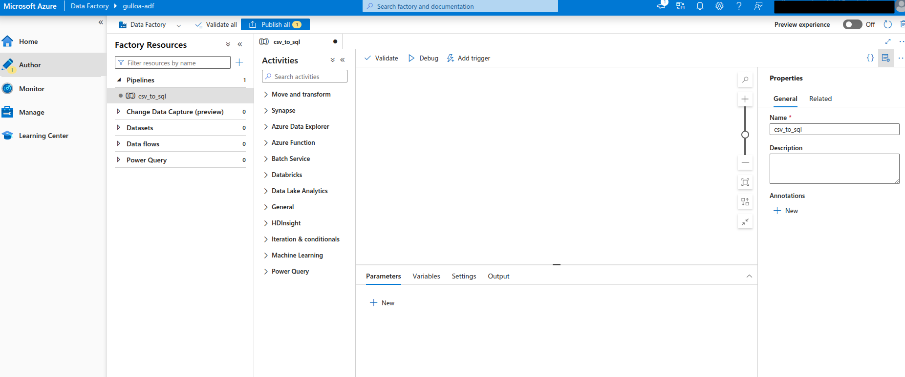

Debajo de la pestaña `Manage` vamos a crear un `Linked Service` a nuestro almacenamiento.
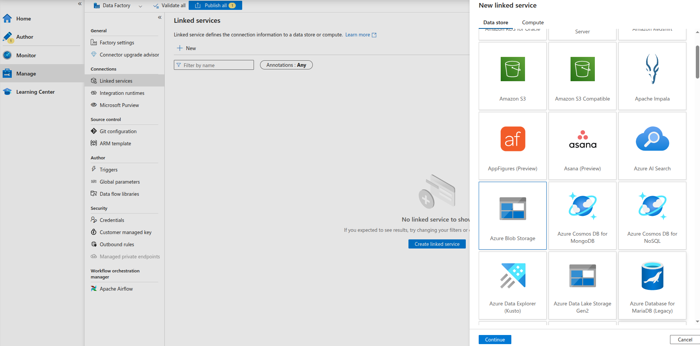

Completa los campos y prueba la conexión, por último `Create`.
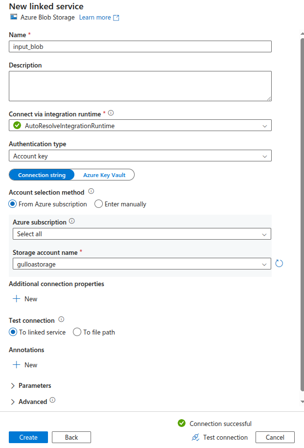

Nuevamente en el campo `Manage` agregamos un dataset.
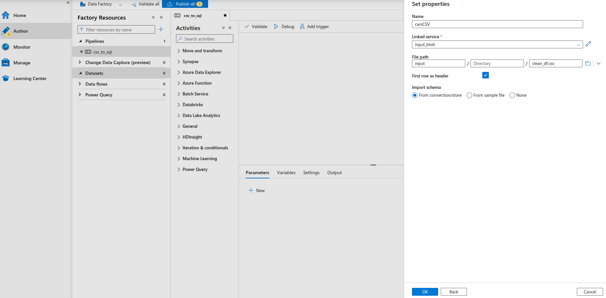

Ahora agregamos un segundo `Linked Service` esta vez para nuestra base de datos.
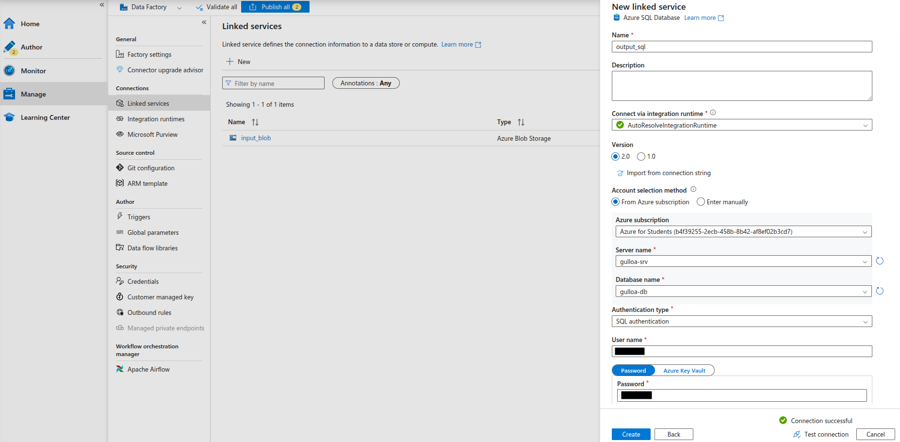

Luego debemos agregar un segundo dataset
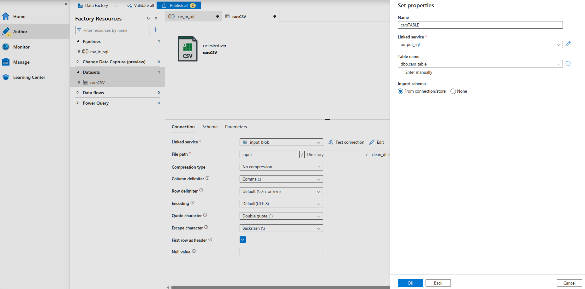

Volvamos a nuestra pipeline la cual llamamos `csv_to_sql`. Agreguemos una actividad `copy data`.
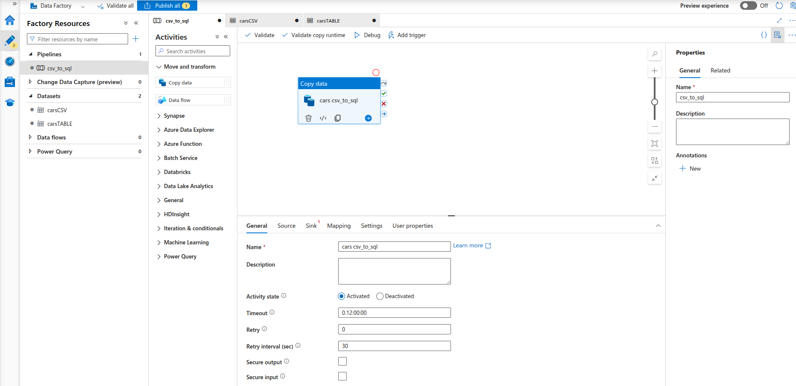

Completamos los campos `source`, `sink`, `mapping`
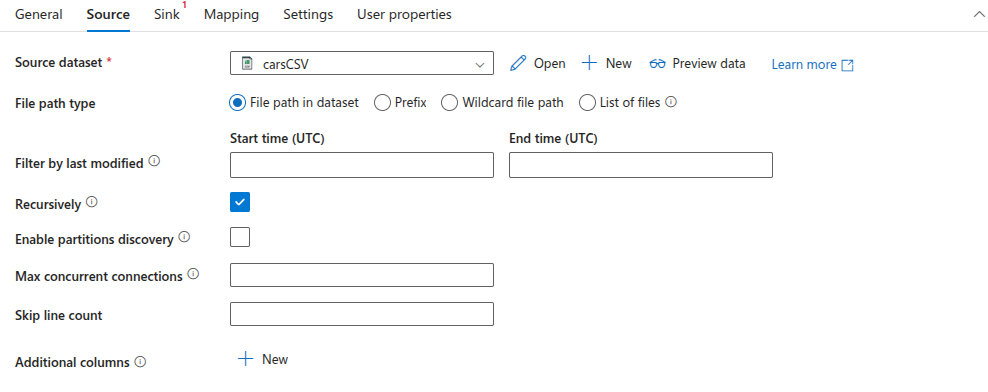
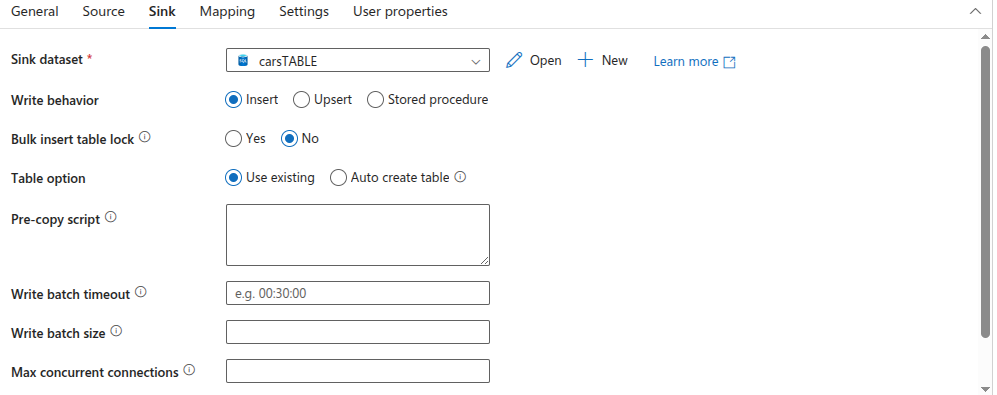
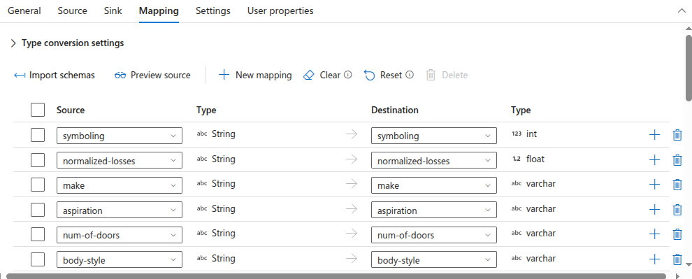

Luego damos click en `Debug` y finalmente `Publish all`.
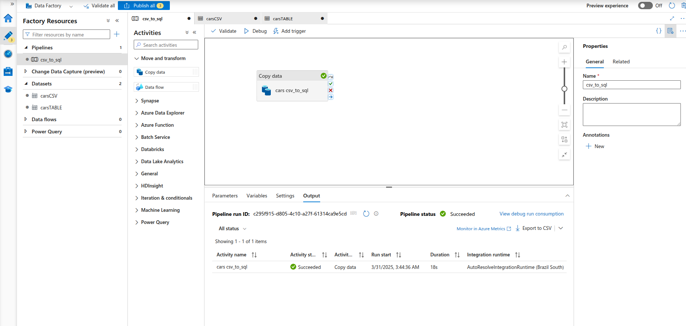

Verificamos nuestra tabla en la base de datos:
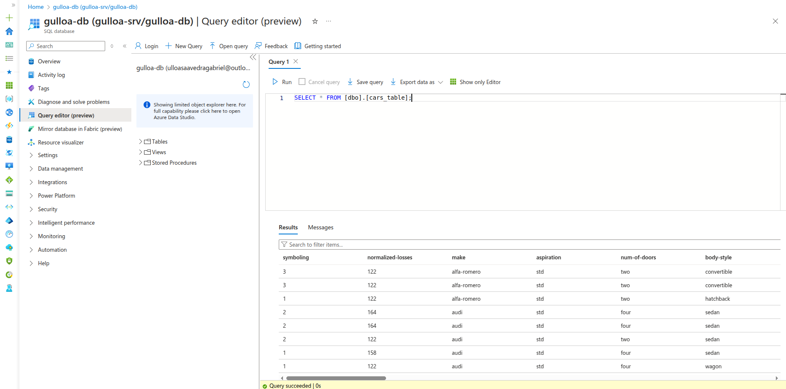
